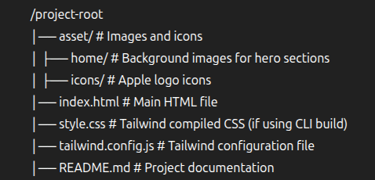

# Apple Website Clone (Tailwind CSS)

This project is a **responsive Apple-like webpage** built using **Tailwind CSS**.  
It replicates sections from Apple's official website, including:

- **Hero background banners** with flex layouts
- **Product sections** like MacBook Pro, iPad, and Apple Watch
- **Apple-style footer** with multiple link categories

---

## ✨ Features

- **Pixel-perfect Apple UI** inspired design
- **Fully responsive** with `flex` and `grid` layouts
- **Background image banners** using Tailwind's `bg-cover` and `bg-center`
- **Hover effects** for interactive links
- **Reusable components** for multiple sections
- **Footer** modeled after Apple's site with multiple navigation columns

---

## 📂 Project Structure



---

## 🚀 Getting Started

### 1️⃣ Clone the Repository

```bash
git clone https://github.com/NatnaelAbWe/old-apple-website
cd old-apple-website
```

## Install Dependacies

```bash
npm install
```
