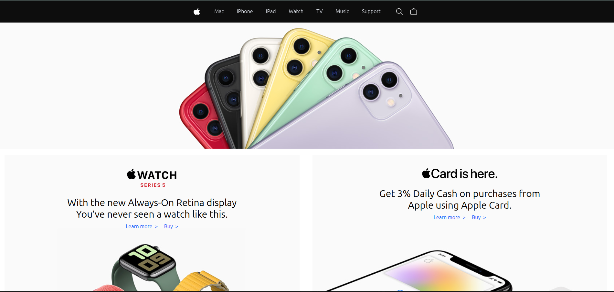
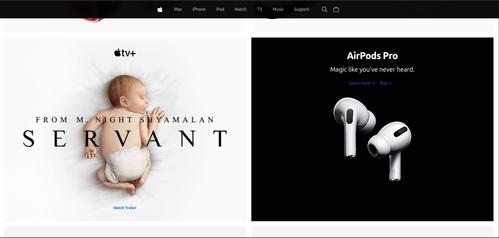
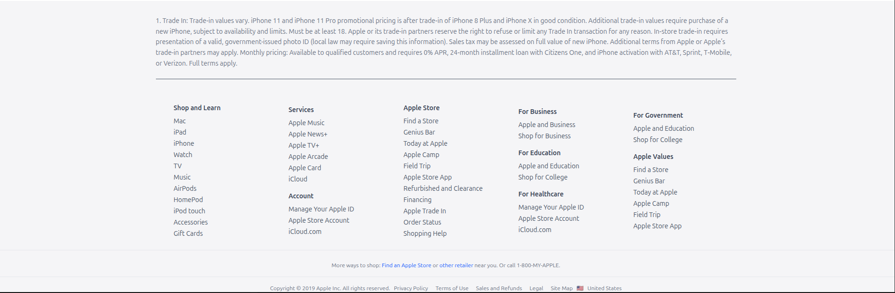

# Apple Website Clone (Tailwind CSS)

This project is a **responsive Apple-like webpage** built using **Tailwind CSS**.  
It replicates sections from Apple's official website, including:

- **Hero background banners** with flex layouts
- **Product sections** like MacBook Pro, iPad, and Apple Watch
- **Apple-style footer** with multiple link categories

---

## ✨ Features

- **Pixel-perfect Apple UI** inspired design
- **Fully responsive** with `flex` and `grid` layouts
- **Background image banners** using Tailwind's `bg-cover` and `bg-center`
- **Hover effects** for interactive links
- **Reusable components** for multiple sections
- **Footer** modeled after Apple's site with multiple navigation columns

---

## 📂 Project Structure


---

## 🚀 Getting Started

### 1️⃣ Clone the Repository

```bash
git clone https://github.com/NatnaelAbWe/old-apple-website
cd old-apple-website
```

### Install Dependacies

```bash
npm install
```

### Run the Project

```bash
npm run tailwind
```

## 💻 Usage

### To use or adapt this project:

- Install **Tailwind CSS** in your environment.

- Copy the sections you need into your HTML page.

- Replace the images inside /asset with your own.

- Modify background paths in the HTML:

## 🎨 Customization

- Change background images in asset/home.

- Adjust text, button colors, and sizes in Tailwind classes.

- Replace placeholder links (#) with real product pages.

## Screenshot

### Production Section





## Footer Section



## 📄 License

This project is open-source under the MIT License.

## 🙌 Credits

- Design Inspiration: Apple.com

- Framework: tailwindcss.com
